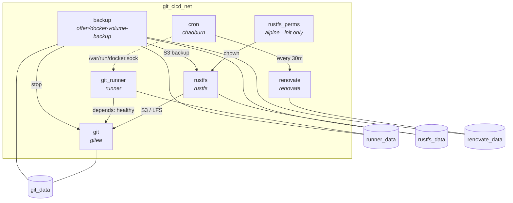

# Gitea — Self-Hosted Git & CI/CD

Self-hosted Gitea instance with a CI/CD runner (act_runner), S3-compatible object storage (RustFS), and automated dependency updates (Renovate).

## Architecture



| Service | Image | Description |
|---------|-------|-------------|
| [**git**](https://github.com/go-gitea/gitea) | [`gitea/gitea`](https://hub.docker.com/r/gitea/gitea) | Git hosting with Actions CI/CD |
| [**git_runner**](https://gitea.com/gitea/runner) | [`gitea/runner`](https://hub.docker.com/r/gitea/runner) | CI/CD runner (ubuntu, elixir) |
| [**rustfs**](https://github.com/rustfs/rustfs) | [`rustfs/rustfs`](https://hub.docker.com/r/rustfs/rustfs) | S3-compatible object storage |
| [**cron**](https://github.com/PremoWeb/chadburn) | [`premoweb/chadburn`](https://hub.docker.com/r/premoweb/chadburn) | Job scheduler |
| [**renovate**](https://github.com/renovatebot/renovate) | [`renovate/renovate`](https://hub.docker.com/r/renovate/renovate) | Dependency update automation |
| [**backup**](https://github.com/offen/docker-volume-backup) | [`offen/docker-volume-backup`](https://hub.docker.com/r/offen/docker-volume-backup) | Automated volume backups to S3 |

## Prerequisites

- [`docker`](https://docs.docker.com/get-docker/) and [`docker compose v2`](https://docs.docker.com/compose/install/)
- `docker` socket access (required by `git_runner` and `cron`)

## Quick Start

```bash
# 1. Clone the repository
git clone <repo-url> && cd gitea

# 2. Create a docker-compose.override.yml for your local secrets
#    (this file is gitignored)

# 3. Generate Gitea secrets (paste results into your override file)
docker compose run --rm -u git git gitea generate secret LFS_JWT_SECRET
docker compose run --rm -u git git gitea generate secret SECRET_KEY
docker compose run --rm -u git git gitea generate secret INTERNAL_TOKEN
docker compose run --rm -u git git gitea generate secret JWT_SECRET

# 4. (Optional) Generate RustFS credentials
python3 -c "import secrets; print('RUSTFS_ACCESS_KEY=' + secrets.token_urlsafe(20))"
python3 -c "import secrets; print('RUSTFS_SECRET_KEY=' + secrets.token_urlsafe(40))"

# 5. Start cron, renovate, and rustfs services
docker compose up -d cron renovate rustfs

# 6. Configure rustfs access to gitea through the visual interface

# 7. Start gitea service
docker compose up -d git

# 8. Configure gitea action token through the admin interface or through the cli
docker compose exec -u git git gitea actions generate-runner-token

# 9. Verify services are healthy
docker compose ps
```

Access Gitea at `http://<GIT_DOMAIN>:<GIT_HTTP_PORT>` (default: `http://127.0.0.1:3000`).

### Migrate storage from local to s3-like

Before enabling `storage.STORAGE_TYPE` to `minio`, the local files must be migrated. This is done by running the command `gitea migrate-storage`. Note: this command is not documented in the official Gitea CLI reference — verify with `gitea migrate-storage --help` if upgrading.

#### Prerequisites

1. **Stop Gitea** to prevent concurrent writes during migration
2. **Ensure the S3 bucket exists** — the migration command does not create it
3. **Migrate before changing config** — run all migration commands first, then set `GIT_STORAGE_TYPE=minio`

#### Command options

* `--type`, `-t`: Type of stored files to copy. Allowed types: `attachments`, `lfs`, `avatars`, `repo-avatars`, `repo-archivers`, `packages`, `actions-log`, `actions-artifacts`
* `--storage`, `-s`: New storage type: `local` (default), `minio` or `azureblob`
* `--path`, `-p`: New storage placement if store is local
* `--minio-endpoint`: Minio storage endpoint
* `--minio-access-key-id`: Minio storage accessKeyID
* `--minio-secret-access-key`: Minio storage secretAccessKey
* `--minio-bucket`: Minio storage bucket
* `--minio-location`: Minio storage location (region) to create bucket
* `--minio-base-path`: Minio storage base path on the bucket
* `--minio-use-ssl`: Enable SSL for minio (default: `false`)

The [default base path for each type](https://docs.gitea.com/administration/config-cheat-sheet#overrided-configurations-storage_override) is:

| `--type` value | base path |
|----------------|-----------|
| `attachments` | `attachments/` |
| `lfs` | `lfs/` |
| `avatars` | `avatars/` |
| `repo-avatars` | `repo-avatars/` |
| `repo-archivers` | `repo-archive/` |
| `packages` | `packages/` |
| `actions-log` | `actions_log/` |
| `actions-artifacts` | `actions_artifacts/` |

#### Migration

> **Note**: The environment variables below (e.g. `${GITEA__storage__MINIO_ENDPOINT}`) are resolved **inside the container** — they are set via the `environment:` block in `docker-compose.yml`, not on the host.

Execute the commands below to migrate from local to s3-like storage:

```bash
for type_path in "attachments:attachments/" "lfs:lfs/" "avatars:avatars/" \
  "repo-avatars:repo-avatars/" "repo-archivers:repo-archive/" "packages:packages/" \
  "actions-log:actions_log/" "actions-artifacts:actions_artifacts/"; do
  type="${type_path%%:*}"
  path="${type_path##*:}"
  docker compose exec -u git git gitea migrate-storage \
    --storage minio \
    --minio-endpoint "${GITEA__storage__MINIO_ENDPOINT}" \
    --minio-access-key-id "${GITEA__storage__MINIO_ACCESS_KEY_ID}" \
    --minio-secret-access-key "${GITEA__storage__MINIO_SECRET_ACCESS_KEY_ID}" \
    --minio-bucket "${GITEA__storage__MINIO_BUCKET}" \
    --minio-location "${GITEA__storage__MINIO_LOCATION}" \
    --type "$type" \
    --minio-base-path "$path"
done
```

After migration completes, set `GIT_STORAGE_TYPE=minio` in your override file and start Gitea:

```bash
docker compose up -d git
```

## Configuration

All configuration is done through environment variables. Create a `docker-compose.override.yml` to override the defaults — this file is gitignored and is the recommended place for local secrets.

### Gitea

| Variable | Description | Default |
|----------|-------------|---------|
| `GIT_DOMAIN` | Gitea public domain | `127.0.0.1` |
| `GIT_HTTP_PORT` | Gitea HTTP port | `3000` |
| `GIT_SSH_DOMAIN` | SSH domain | `127.0.0.1` |
| `GIT_SSH_PORT` | Public SSH port | `222` |
| `GIT_DB_TYPE` | Database type (`sqlite3`, `mysql`, `postgres`) | `sqlite3` |
| `GIT_STORAGE_TYPE` | Storage backend (`local` or `minio`) | `local` |
| `GIT_MINIO_ENDPOINT` | S3 storage endpoint | `rustfs:9000` |
| `GIT_MINIO_BUCKET` | S3 storage bucket | `gitea` |
| `GIT_DISABLE_REGISTRATION` | Disable new user sign-ups | `true` |
| `GIT_SERVER_LFS_JWT_SECRET` | LFS authentication secret | *(generate — see Quick Start)* |
| `GIT_SECURITY_SECRET_KEY` | Session security key | *(generate)* |
| `GIT_SECURITY_INTERNAL_TOKEN` | Internal API token | *(generate)* |
| `GIT_OAUTH2_JWT_SECRET` | OAuth2 JWT signing secret | *(generate)* |

### Runner

| Variable | Description | Default |
|----------|-------------|---------|
| `GIT_RUNNER_REGISTRATION_TOKEN` | Token to register the runner | `gitea-runner-token` |
| `GIT_RUNNER_NAME` | Runner display name | `local-runner` |
| `GIT_RUNNER_LABELS` | Runner job labels | `ubuntu-latest,ubuntu-24.04,ubuntu-22.04,elixir-1.19.5-otp-28` |

Supported labels:

| Label | Image |
|-------|-------|
| `ubuntu-latest` | `docker.gitea.com/runner-images:ubuntu-latest` |
| `ubuntu-24.04` | `docker.gitea.com/runner-images:ubuntu-24.04` |
| `ubuntu-22.04` | `docker.gitea.com/runner-images:ubuntu-22.04` |
| `elixir-1.19.5-otp-28` | `hexpm/elixir:1.19.5-erlang-28.4.1-debian-trixie` |

### RustFS (S3 Storage)

| Variable | Description | Default |
|----------|-------------|---------|
| `RUSTFS_ACCESS_KEY` | S3 access key | `rustfsadmin` |
| `RUSTFS_SECRET_KEY` | S3 secret key | `rustfsadmin` |

Generate secure credentials:

```bash
python3 -c "import secrets; print(secrets.token_urlsafe(20))"  # access key
python3 -c "import secrets; print(secrets.token_urlsafe(40))"  # secret key
```

### Renovate

| Variable | Description | Default |
|----------|-------------|---------|
| `GITHUB_COM_TOKEN` | GitHub API token (avoids rate limits) | — |
| `RENOVATE_TOKEN` | Gitea API token for Renovate | — |
| `RENOVATE_GIT_AUTHOR` | Commit author for Renovate PRs | `renovate <renovate@example.com>` |

### Config Files

| Path | Service | Description |
|------|---------|-------------|
| `config/git/app.ini` | Gitea | Main Gitea configuration |
| `config/git_runner/config.yml` | Runner | Runner labels, cache, container options |
| `config/cron/config.ini` | Cron | Chadburn scheduler settings |
| `config/renovate/config.js` | Renovate | Renovate platform & endpoint config |

### Storage

By default, Gitea uses local storage. To switch to S3-compatible storage (RustFS):

1. Set `GIT_STORAGE_TYPE=minio`
2. Ensure `RUSTFS_ACCESS_KEY` and `RUSTFS_SECRET_KEY` are set
3. The bucket `gitea` will be used automatically

### Backup

Automated volume backups using [offen/docker-volume-backup](https://github.com/offen/docker-volume-backup). Backs up all volumes to an S3 bucket on RustFS on a daily schedule.

**Prerequisites:**

1. Create the backup bucket in RustFS (e.g. `gitea-backups`) through its web UI or CLI
2. Ensure RustFS credentials allow read/write to the backup bucket

**How it works:**

- Runs on a cron schedule (default: daily at 2 AM)
- Stops Gitea before backup (via Docker label) for SQLite consistency
- Creates compressed tar archives of all 4 volumes
- Uploads to the configured S3 bucket
- Prunes backups older than the retention period (default: 30 days)
- Restarts Gitea after backup completes

**Manual backup:**

```bash
docker compose run --rm backup
```

**Restore from backup:**

```bash
# 1. Stop services
docker compose stop git git_runner

# 2. Download the latest backup from S3 (using mc or the RustFS web UI)
# 3. Extract volumes from the backup archive
for vol in git_data runner_data rustfs_data renovate_data; do
  docker run --rm \
    -v "gitea_${vol}:/target" \
    -v "$(pwd)/backups:/backups" \
    alpine sh -c "rm -rf /target/* && tar xzf /backups/${vol}-*.tar.gz -C /target --strip-components=1"
done

# 4. Restart services
docker compose up -d git git_runner
```

#### Backup configuration

| Variable | Description | Default |
|----------|-------------|---------|
| `BACKUP_S3_BUCKET` | S3 bucket for storing backups | `gitea-backups` |
| `BACKUP_CRON` | Cron expression for schedule | `0 2 * * *` |
| `BACKUP_RETENTION_DAYS` | Days to keep backups (`-1` = forever) | `30` |

## Notes

- **Docker socket access** is required by `git_runner` (to run job containers) and `cron` (to invoke Renovate). This grants these services broad host access — only use in trusted environments.
- **Renovate** runs on a 30-minute cron schedule managed by Chadburn. It autodiscovers repositories on the configured Gitea instance.
- **Port 222** is mapped for SSH Git access. Ensure your SSH client uses this port: `git clone ssh://git@<host>:222/<repo>.git`.
