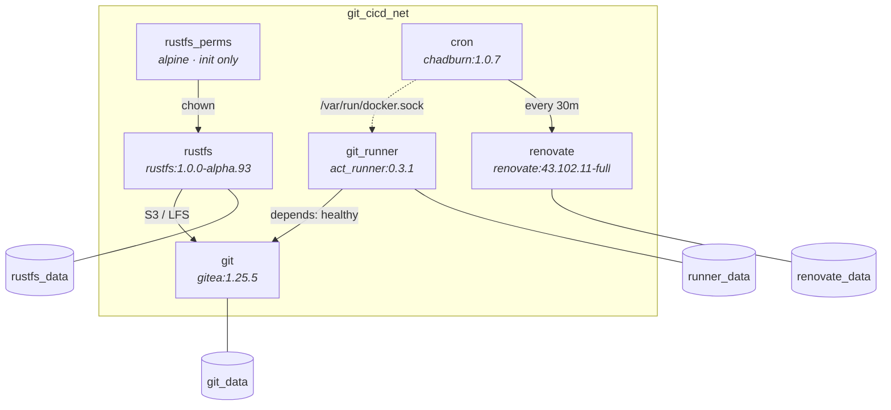

# Gitea — Self-Hosted Git & CI/CD

Self-hosted Gitea instance with a CI/CD runner (act_runner), S3-compatible object storage (RustFS), and automated dependency updates (Renovate).

## Architecture



| Service | Image | Description |
|---------|-------|-------------|
| **git** | `gitea/gitea:1.25.5` | Git hosting with Actions CI/CD |
| **git_runner** | `gitea/act_runner:0.3.1` | CI/CD runner (ubuntu, elixir) |
| **rustfs** | `rustfs/rustfs:1.0.0-alpha.93` | S3-compatible object storage |
| **cron** | `premoweb/chadburn:1.0.7` | Job scheduler |
| **renovate** | `renovate/renovate:43.102.11-full` | Dependency update automation |

## Prerequisites

- [Docker](https://docs.docker.com/get-docker/) and [Docker Compose v2](https://docs.docker.com/compose/install/)
- Docker socket access (required by `git_runner` and `cron`)

## Quick Start

```bash
# 1. Clone the repository
git clone <repo-url> && cd gitea

# 2. Create a docker-compose.override.yml for your local secrets
#    (this file is gitignored)

# 3. Generate Gitea secrets (paste results into your override file)
docker compose run --rm -u git git gitea generate secret LFS_JWT_SECRET
docker compose run --rm -u git git gitea generate secret SECRET_KEY
docker compose run --rm -u git git gitea generate secret INTERNAL_TOKEN
docker compose run --rm -u git git gitea generate secret JWT_SECRET

# 4. (Optional) Generate RustFS credentials
python3 -c "import secrets; print('RUSTFS_ACCESS_KEY=' + secrets.token_urlsafe(20))"
python3 -c "import secrets; print('RUSTFS_SECRET_KEY=' + secrets.token_urlsafe(40))"

# 5. Start cron, renovate, and rustfs services
docker compose up -d cron renovate rustfs

# 6. Configure rustfs access to gitea through the visual interface

# 7. Start gitea service
docker compose up -d git

# 8. Configure gitea action token through the admin interface or through the cli
docker compose exec -u git git gitea actions generate-runner-token

# 9. Verify services are healthy
docker compose ps
```

Access Gitea at `http://<GIT_DOMAIN>:<GIT_HTTP_PORT>` (default: `http://127.0.0.1:3000`).

## Configuration

All configuration is done through environment variables. Create a `docker-compose.override.yml` to override the defaults — this file is gitignored and is the recommended place for local secrets.

### Gitea

| Variable | Description | Default |
|----------|-------------|---------|
| `GIT_DOMAIN` | Gitea public domain | `127.0.0.1` |
| `GIT_HTTP_PORT` | Gitea HTTP port | `3000` |
| `GIT_SSH_DOMAIN` | SSH domain | `127.0.0.1` |
| `GIT_SSH_PORT` | Public SSH port | `222` |
| `GIT_DB_TYPE` | Database type (`sqlite3`, `mysql`, `postgres`) | `sqlite3` |
| `GIT_STORAGE_TYPE` | Storage backend (`local` or `minio`) | `local` |
| `GIT_DISABLE_REGISTRATION` | Disable new user sign-ups | `true` |
| `GIT_SERVER_LFS_JWT_SECRET` | LFS authentication secret | *(generate — see Quick Start)* |
| `GIT_SECURITY_SECRET_KEY` | Session security key | *(generate)* |
| `GIT_SECURITY_INTERNAL_TOKEN` | Internal API token | *(generate)* |
| `GIT_OAUTH2_JWT_SECRET` | OAuth2 JWT signing secret | *(generate)* |

### Runner

| Variable | Description | Default |
|----------|-------------|---------|
| `GIT_RUNNER_REGISTRATION_TOKEN` | Token to register the runner | `gitea-runner-token` |
| `GIT_RUNNER_NAME` | Runner display name | `local-runner` |
| `GIT_RUNNER_LABELS` | Runner job labels | `ubuntu-latest,ubuntu-24.04,ubuntu-22.04,elixir-1.19.5-otp-28` |

Supported labels:

| Label | Image |
|-------|-------|
| `ubuntu-latest` | `docker.gitea.com/runner-images:ubuntu-latest` |
| `ubuntu-24.04` | `docker.gitea.com/runner-images:ubuntu-24.04` |
| `ubuntu-22.04` | `docker.gitea.com/runner-images:ubuntu-22.04` |
| `elixir-1.19.5-otp-28` | `hexpm/elixir:1.19.5-erlang-28.4.1-debian-trixie` |

### RustFS (S3 Storage)

| Variable | Description | Default |
|----------|-------------|---------|
| `RUSTFS_ACCESS_KEY` | S3 access key | `rustfsadmin` |
| `RUSTFS_SECRET_KEY` | S3 secret key | `rustfsadmin` |

Generate secure credentials:

```bash
python3 -c "import secrets; print(secrets.token_urlsafe(20))"  # access key
python3 -c "import secrets; print(secrets.token_urlsafe(40))"  # secret key
```

### Renovate

| Variable | Description | Default |
|----------|-------------|---------|
| `GITHUB_COM_TOKEN` | GitHub API token (avoids rate limits) | — |
| `RENOVATE_TOKEN` | Gitea API token for Renovate | — |
| `RENOVATE_GIT_AUTHOR` | Commit author for Renovate PRs | `renovate <renovate@example.com>` |

### Config Files

| Path | Service | Description |
|------|---------|-------------|
| `config/git/app.ini` | Gitea | Main Gitea configuration |
| `config/git_runner/config.yml` | Runner | Runner labels, cache, container options |
| `config/cron/config.ini` | Cron | Chadburn scheduler settings |
| `config/renovate/config.js` | Renovate | Renovate platform & endpoint config |

### Storage

By default, Gitea uses local storage. To switch to S3-compatible storage (RustFS):

1. Set `GIT_STORAGE_TYPE=minio`
2. Ensure `RUSTFS_ACCESS_KEY` and `RUSTFS_SECRET_KEY` are set
3. The bucket `gitea` will be used automatically

## Notes

- **Docker socket access** is required by `git_runner` (to run job containers) and `cron` (to invoke Renovate). This grants these services broad host access — only use in trusted environments.
- **Renovate** runs on a 30-minute cron schedule managed by Chadburn. It autodiscovers repositories on the configured Gitea instance.
- **Port 222** is mapped for SSH Git access. Ensure your SSH client uses this port: `git clone ssh://git@<host>:222/<repo>.git`.
